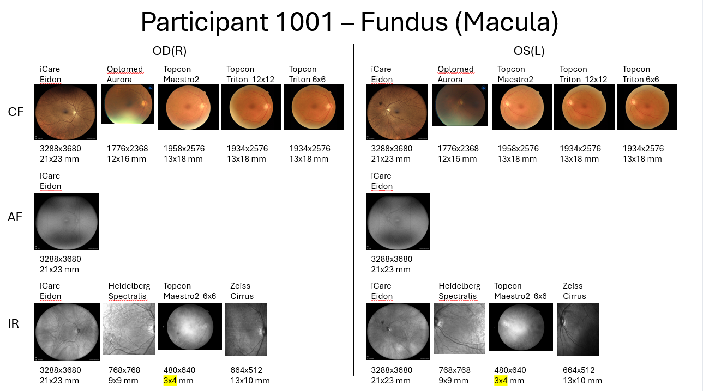

# Automatically reading images from DICOM files and display them in panel.
Author: Roy Huang

Last updated: 1/24/2025

For the current process, we assume we already have the summary csv file that including image details and dimension information. We will use the `pandas` library to read the csv file and `pydicom` library to read the DICOM files. Example code requires manual changes to tailor users' purposes, such as selecting a participant, creating a pptx file, and designing the layout, file path, file name, etc.

## Key libraries
- pandas
- pydicom
- python-pptx
- PIL
- cv2

## 1. Creating the initial pptx file

- The first part of `1002_get_optic_disc.ipynb` will select a participant and creating a pptx file with the layout of the image display panel. For example, we will use participant 1002 in the summary csv file. 

- The second par of `1002_get_optic_disc.ipynb` will create a pptx file, each slide will contain one image with description and image dimension information.

Each slide will look like this:

- We can now create a slide in the pptx file to manually design the layout. 

For example: 

Make sure the images/text align on the top for each row. This way we can automatically read in the layout as a json format and sort the image/text order. (Align function in Microsoft PowerPoint)

 

## 2. Saving the layout as a json file
- `pptx2json.ipynb` reads the pptx file and save as a json file. Elements are sorted in a top-down, left-right order. 

- Make sure to change the order of the list to the image order. Each string should be consistent with the image label generated in the previous pptx file. Modify duplicate image labels if necessary.

 

## 3. Generate the demo image panel
- `macula_image_generation_all.py` reads the json file and generate a demo image panel. 

- We can modify the resolution of the image panel by changing the global variable `SCALER`. 

- To make sure the images are generated correctly, generating 10 images first and check the output. 

- Now we can successfully generate all of the demo image panels. 